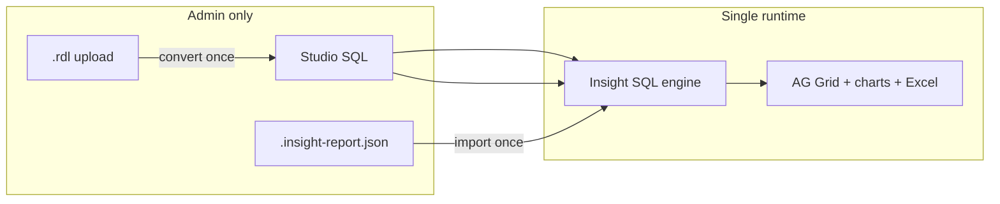

# Insight Portal

SQL-first reporting & management dashboard for organizations (Rahkaran / SQL Server).
White-label ready: company name, logo, colors, and admin account via a first-time setup wizard.

**Insight is the only report runtime** — legacy RDL files are imported and converted once; end users always run native SQL reports (grid, charts, Excel).

---

## Contents

1. [Requirements](#requirements)
2. [Quick start (local)](#quick-start-local)
3. [Documentation & guides](#documentation--guides)
4. [Environment variables](#environment-variables)
5. [First-time setup wizard](#first-time-setup-wizard)
6. [How to use the product](#how-to-use-the-product)
7. [Build & deploy on a server](#build--deploy-on-a-server)
8. [Updating](#updating)
9. [Troubleshooting](#troubleshooting)
10. [Security checklist](#security-checklist)

---

## Requirements

| Component      | Notes                                                                                  |
| -------------- | -------------------------------------------------------------------------------------- |
| **Node.js**    | 20 LTS or newer                                                                        |
| **npm**        | Comes with Node                                                                        |
| **SQL Server** | Two roles recommended: (1) app DB for Prisma metadata, (2) read-only Rahkaran / ERP DB |
| **OS**         | Windows Server or Linux                                                                |

Create an empty database for the app, for example:

```sql
CREATE DATABASE InsightPortal;
```

Use a SQL login that can create tables in that database (`db_owner` for install is fine; you can reduce rights later).

For Rahkaran, use a **read-only** login (`db_datareader` or equivalent). The portal never writes to Rahkaran.

---

## Quick start (local)

```bash
# 1) Install dependencies
npm install

# 2) Configure environment
cp .env.example .env.local
# Windows: copy .env.example .env.local
# Edit .env.local — at least DATABASE_URL, AUTH_SECRET, NEXTAUTH_URL

# 3) Create / update app tables
npx prisma db push

# 4) (Optional) Sample modules + priority reports
npm run db:seed

# 5) Run development server
npm run dev
```

Open: [http://localhost:3000](http://localhost:3000)

- If setup is not finished → you are sent to **`/setup`**
- Otherwise → **`/login`**

### Useful scripts

| Command                             | Purpose                                  |
| ----------------------------------- | ---------------------------------------- |
| `npm run dev`                       | Development (hot reload)                 |
| `npm run build`                     | Production build                         |
| `npm run start`                     | Run production build (default port 3000) |
| `npx prisma db push`                | Sync Prisma schema to SQL Server         |
| `npm run db:seed`                   | Seed modules, sample reports, lookups    |
| `npm run report:scaffold -- --id …` | Scaffold a report from a `.sql` file     |
| `npm run rdl:import -- --dir …`     | Bulk import `.rdl` files from disk (CLI) |

---

## Documentation & guides

Detailed guides live in [`docs/`](./docs/README.md):

| Guide | Description |
| ----- | ----------- |
| [**Admin guide**](./docs/guides/admin-guide.md) | Modules, Studio, access, branding, create-report hub |
| [**RDL migration**](./docs/guides/rdl-migration.md) | Bulk import from FBC/disk, browser batch, cutover workflow |
| [**Report packages**](./docs/guides/report-packages.md) | `.insight-report.json` export/import between servers |
| [**Report grid**](./docs/guides/report-grid.md) | Results table: search, filters, CSV vs Excel |
| [**Deploy & operations**](./docs/guides/deploy-and-ops.md) | Install, PM2, HTTPS, updates, troubleshooting |
| [**UI patterns**](./docs/guides/ui-patterns.md) | Page chrome, forms, surfaces, design tokens |

### Key admin URLs

| Path | Purpose |
| ---- | ------- |
| `/admin/reports/new` | Create-report hub (Studio · package · RDL) |
| `/admin/reports` | Studio index + package import panel |
| `/admin/rdl` | Legacy RDL upload, filters, bulk convert |
| `/modules` | Modules, folders, report placement |
| `/access` | Users, passwords, ACL |

---

## Environment variables

Copy `.env.example` to `.env.local` (dev) or `.env` / system env (production).

### Required

```env
# App metadata DB (Prisma)
DATABASE_URL="sqlserver://HOST:1433;database=InsightPortal;user=USER;password=PASS;encrypt=true;trustServerCertificate=true"

# Auth.js — generate a long random string
AUTH_SECRET=change-me-to-a-long-random-secret

# Public URL of this installation (no trailing slash)
NEXTAUTH_URL=http://localhost:3000
```

Generate `AUTH_SECRET` (example):

```bash
node -e "console.log(require('crypto').randomBytes(32).toString('hex'))"
```

### Rahkaran / ERP (recommended for live reports)

```env
RAHKARAN_DB_SERVER=your-sql-server
RAHKARAN_DB_NAME=your-database
RAHKARAN_DB_USER=your-readonly-user
RAHKARAN_DB_PASSWORD=your-password
RAHKARAN_DB_ENCRYPT=true
RAHKARAN_DB_TRUST_SERVER_CERTIFICATE=true
```

Without these, the UI and branding still work; report execution against Rahkaran will fail until they are set.

### Optional

```env
ADMIN_SYNC_SECRET=          # if set, sync-users also needs header x-admin-secret
NEXT_PUBLIC_APP_NAME=Insight Portal
NEXT_PUBLIC_COMPANY_NAME=
SEED_ADMIN_USER=admin       # only used by npm run db:seed
SEED_ADMIN_PASSWORD=admin123
```

On Windows Server, if `trustServerCertificate` is required for internal SQL:

```env
DATABASE_URL="sqlserver://...;encrypt=true;trustServerCertificate=true"
```

---

## First-time setup wizard

1. Start the app and open **`/setup`** (automatic if no admin exists yet).
2. Complete the three steps:
   - **Company** — Persian / English name, product name, support contacts
   - **Brand** — logo, favicon, primary & accent colors
   - **Admin** — username (min 3 chars) and password (min 8 chars)
3. You are redirected to **`/login`**. Sign in with the admin you just created.

Later changes: admin menu **تنظیمات برند** → `/settings`.

> **Existing installs:** if an admin user already exists (e.g. after `db:seed`), the wizard is skipped automatically.

---

## How to use the product

### Roles

| Role      | Can do                                                    |
| --------- | --------------------------------------------------------- |
| **Admin** | Everything: reports, Studio, RDL manager, access, branding |
| **User**  | Only reports/modules granted on `/access`                 |

### Typical admin first day

1. Log in at `/login`
2. **ماژول‌ها و پوشه‌ها** (`/modules`) → create modules and folders
3. (Optional) **دسترسی‌ها** → sync users → set passwords → grant modules/reports
4. **گزارش جدید** (`/admin/reports/new`) → Studio, package import, or RDL path
5. Test under **گزارش‌ها** → filters → run → Excel
6. **تنظیمات برند** → customer look

See the [**Admin guide**](./docs/guides/admin-guide.md) for full workflows.

### End-user flow

1. Log in
2. Dashboard or **گزارش‌ها**
3. Choose report → fill filters (Jalali dates like `1404/01/01`) → run → export Excel
4. In results: use grid toolbar for search, column filters, and quick CSV export — see [Report grid guide](./docs/guides/report-grid.md)

### Report architecture (summary)



- **No** end-user “RDL vs Insight” toggle; **no** SSRS renderer in browser.
- **Origin tracking:** `sourceType` = `studio` | `package` | `rdl` (badges on `/admin/reports`).
- **Migration:** see [**RDL migration guide**](./docs/guides/rdl-migration.md).

Quick CLI example (FBC legacy folder):

```bash
npm run rdl:import -- --dir "C:/Users/MehrshadB/Desktop/FBC/Current Server Version/RDL" \
  --module financial --limit 3 --recursive --convert
```

### Report packages (summary)

Format: `{slug}.insight-report.json` — full definition + SQL + placement.

- **Export:** Studio → **صادر کردن بسته**
- **Import:** hub or Studio index — single or multiple files

Details: [**Report packages guide**](./docs/guides/report-packages.md).

### Access control

- Admins see all reports
- Others need module and/or report grants on `/access`
- Sync: Access page button, or `POST /api/admin/sync-users`

### Important product rules

- Rahkaran is **read-only** — no writes from the portal
- App passwords are bcrypt in the **app** database
- All report queries use **parameterized** SQL (`@Param`)

---

## Build & deploy on a server

Full steps: [**Deploy & operations guide**](./docs/guides/deploy-and-ops.md).

```bash
cd /path/to/Insight-Portal
npm ci
npx prisma db push
npm run build
npm run start
```

Set `NEXTAUTH_URL` to the public URL. Use PM2, NSSM, or a reverse proxy for HTTPS.

Health check: `GET /api/health`

Back up: SQL database `InsightPortal`, folder `public/uploads/branding/`, and `data/rdl/` if used.

---

## Updating

```bash
# stop the process (pm2 stop / stop Windows service)
git pull
npm ci
npx prisma db push
npm run build
# start again
```

After the migration pipeline release, `db push` adds `Report.sourceType` / `sourceRef` and `RdlReport.convertStatus` / `convertError`.

---

## Troubleshooting

| Problem                           | What to check                                                 |
| --------------------------------- | ------------------------------------------------------------- |
| Redirect loop / always `/setup`   | `DATABASE_URL`; `prisma db push`; no admin user               |
| Login fails                       | Wrong password; user inactive; run setup or seed admin          |
| Reports error / DB not configured | `RAHKARAN_DB_*` missing or login not read-only                |
| Prisma auth error                 | SQL user/password, encrypt / trustServerCertificate, firewall |
| `prisma generate` EPERM (Windows) | Stop `npm run dev` (locks query engine DLL), retry              |
| Logo 404 after deploy             | Restore `public/uploads/branding` or re-upload in Settings      |
| Auth callback issues behind HTTPS | `NEXTAUTH_URL` must match public URL exactly (`https://`)     |
| RDL import / convert fails        | See [RDL migration guide](./docs/guides/rdl-migration.md)       |

Dev logs: terminal where `npm run dev` runs.  
Prod logs: `pm2 logs` or Windows service stdout.

---

## Security checklist

- [ ] Strong unique `AUTH_SECRET`
- [ ] Change admin password after first install (do not leave seed `admin123` in production)
- [ ] Rahkaran SQL login is **read-only**
- [ ] App DB and Rahkaran passwords only in server env (never commit `.env.local`)
- [ ] HTTPS in production (`NEXTAUTH_URL` uses `https://`)
- [ ] Restrict who can reach the server (VPN / firewall) if required
- [ ] Optional: set `ADMIN_SYNC_SECRET` for sync-users hardening

---

## Tech stack (short)

Next.js 16 · TypeScript · Vazirmatn RTL · Tailwind 4 · Prisma 5 · Auth.js · AG Grid · ECharts · exceljs · mssql · fast-xml-parser (RDL)

---

## Support tips for implementers

1. Install app DB → `db push` → `build` → `start` → `/setup`
2. Connect Rahkaran read-only → sync users → grant access on `/access`
3. **New reports:** `/admin/reports/new` hub, or migrate legacy RDL — [**migration guide**](./docs/guides/rdl-migration.md)
4. Pilot with `npm run rdl:import -- --limit 5` before full FBC cutover
5. Customize brand under `/settings` for the customer

For bilingual / Persian UI strings, the product ships RTL by default.
