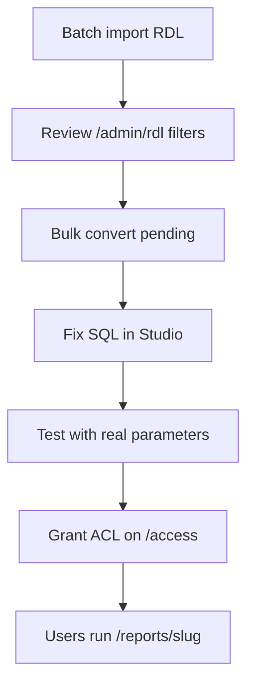

# RDL migration guide

Migrate legacy SSRS / Rahkaran `.rdl` reports into native Insight reports.

**Principle:** RDL is a **one-way bridge**. Upload → inspect SQL/parameters → convert → edit in Studio → publish. End users never see an RDL renderer.

---

## Before you start

1. Run schema sync on the app database:

```bash
npx prisma db push
```

2. Create target **modules** on `/modules` (e.g. `financial`, `warehouse`) — the import `--module` / UI module selector uses the module **slug**.
3. Ensure Rahkaran read-only connection works if converted reports will be tested immediately.

---

## UI path (`/admin/rdl`)

Also reachable from **گزارش جدید** hub → **بارگذاری RDL**.

### Upload

- Select target **module** (default: `imported` = «وارد شده از RDL»).
- Choose **one or many** `.rdl` files.
- Single file → opens detail view; multiple → results table on the list page.

### List filters

| Tab | Shows |
| --- | ----- |
| **همه** | All uploads |
| **نیاز به تبدیل** | `convertStatus=uploaded`, not yet converted |
| **تبدیل‌شده** | Successfully converted |
| **خطا** | `convertStatus=failed` (see `convertError` on row) |

### Bulk convert

- **تبدیل انتخاب‌شده‌ها** — convert checked rows.
- **تبدیل همهٔ تبدیل‌نشده** — convert all pending.

Converted reports appear in `/admin/reports` with an **RDL** badge. Open Studio to fix SQL, parameters, and columns before granting user access.

### Detail view (`/admin/rdl/{id}`)

- Parsed parameters, datasets, column headers
- SQL excerpt and XML preview
- **Convert to Insight report** — creates native report (slug conflict → auto-rename)

---

## CLI path (large folders)

For thousands of files on disk (e.g. FBC legacy tree), use the CLI instead of browser upload.

```bash
cd /path/to/Insight-Portal

# Dry run — import only, first 3 files
npm run rdl:import -- \
  --dir "C:/Users/MehrshadB/Desktop/FBC/Current Server Version/RDL" \
  --module financial \
  --limit 3

# Import entire tree recursively
npm run rdl:import -- \
  --dir "C:/path/to/RDL" \
  --module financial \
  --recursive

# Import + auto-convert to Insight reports
npm run rdl:import -- \
  --dir "C:/path/to/RDL" \
  --module financial \
  --recursive \
  --convert
```

### CLI flags

| Flag | Required | Description |
| ---- | -------- | ----------- |
| `--dir` | Yes | Root folder containing `.rdl` files |
| `--module` | No | Target module slug (default: `imported`) |
| `--limit` | No | Max files to process (useful for testing) |
| `--recursive` | No | Include subdirectories |
| `--convert` | No | After upload, convert each to Insight report |

### CLI output

Progress logs go to **stderr**. A **CSV summary** is printed to **stdout**:

```csv
file,status,slug,error
"report-a.rdl","uploaded","report-a",""
"report-b.rdl","converted","report-b",""
"bad.rdl","import_failed","","فقط فایل .rdl مجاز است"
```

Redirect to a file:

```bash
npm run rdl:import -- --dir "C:/path/RDL" --module financial --recursive > import-log.csv 2> import-progress.log
```

### Storage

- Files: `data/rdl/` (gitignored except `.gitkeep`)
- Metadata: `RdlReport` table (`convertStatus`, `convertError`, `convertedReportSlug`)

---

## API reference (automation)

| Endpoint | Method | Body |
| -------- | ------ | ---- |
| `/api/admin/rdl` | GET | List all RDL uploads |
| `/api/admin/rdl` | POST | `multipart`: `file`, `moduleId` (slug) |
| `/api/admin/rdl/batch` | POST | `multipart`: `files[]`, `moduleId` |
| `/api/admin/rdl/batch/convert` | POST | JSON: `{ ids: string[], moduleId?, publish?: boolean }` |
| `/api/admin/rdl/{id}` | GET | Detail + parsed meta |
| `/api/admin/rdl/{id}/convert` | POST | JSON: `{ moduleId?, slug?, nameFa?, publish? }` |

All routes require **admin** session.

---

## Recommended cutover workflow



1. **Pilot** — CLI `--limit 5` or upload 5 files in UI; convert; validate SQL against Rahkaran.
2. **Batch import** — CLI `--recursive` for full folder (import only first if you want staged review).
3. **Convert** — bulk in UI or CLI `--convert`.
4. **QA in Studio** — focus on reports with `convertStatus=failed` or wrong parameter types.
5. **Organize** — move reports to correct modules/folders on `/modules`.
6. **ACL** — grant modules to user groups; spot-check critical reports at report level.
7. **Go-live** — communicate that URLs are `/reports/{slug}`, not SSRS paths.

---

## What conversion does *not* do

- Pixel-perfect reproduction of SSRS layout (tablix, images, expressions).
- Automatic fix of T-SQL that references SSRS-only functions.
- Subreport wiring beyond basic SQL/dataset extraction.

Expect **manual Studio work** for complex legacy reports.

---

## Troubleshooting

| Issue | Action |
| ----- | ------ |
| Upload fails “فقط فایل .rdl” | File must have `.rdl` extension |
| Upload fails size | Max 15 MB per file (API) |
| `convertStatus=failed` | Open row error; fix SQL in Studio or re-upload after RDL fix |
| Duplicate slug | Auto-renamed (`slug-2`, etc.) on conflict |
| CLI `DATABASE_URL` error | Set `.env` / `.env.local`; run from project root |
| `prisma generate` EPERM (Windows) | Stop `npm run dev`, retry |
| Empty SQL after convert | RDL dataset may use stored proc or shared datasource — edit in Studio |

---

## Related

- [Admin guide](./admin-guide.md)
- [Report packages](./report-packages.md) — export reviewed reports for backup
- [Deploy & operations](./deploy-and-ops.md)
